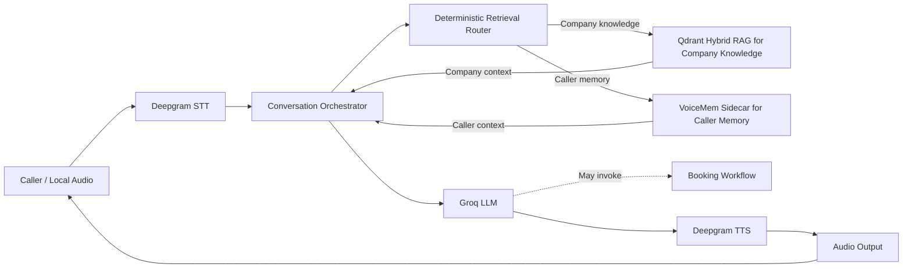

# Architecture

## 1. System Overview

The Agentix AI Voice Receptionist is a local, real-time voice application that combines conversational assistance, grounded company knowledge, persistent caller memory, and appointment booking.

Pipecat coordinates the audio and model pipeline. Deepgram provides speech recognition and synthesis, Groq provides conversational reasoning, Qdrant supplies verified company knowledge, and a separate VoiceMem service supplies selected caller-specific memory. Appointment requests are handled by a stateful LangGraph workflow connected to Google Calendar and Google Sheets.

These responsibilities remain deliberately separate: the language model manages conversation, retrieval systems provide scoped context, and deterministic tools own external actions.

Engineering and change constraints are defined in [Development Rules](RULES.md).

## 2. High-Level Architecture

### High-Level Voice Architecture



### Booking Workflow


Runtime tracing records sanitized turn, retrieval, tool, external-operation, and available provider metric events without participating in the main control flow.

## 3. End-to-End Request Flow

1. The caller speaks through the local audio transport.
2. Deepgram converts speech into a finalized transcript; Silero VAD supports turn detection and interruption handling.
3. Pipecat adds the finalized turn to the conversation context and starts eligible VoiceMem writes without blocking the response path.
4. Deterministic routing decides whether the turn needs company knowledge, caller memory, both, or neither.
5. Qdrant RAG and VoiceMem retrieval run independently and concurrently when both are required. Their results are added only to a temporary copy of the model context.
6. Groq generates a normal conversational answer or invokes the booking tool.
7. Booking requests enter the LangGraph workflow, where Calendar and Sheets operations determine the authoritative result.
8. The response is sent to Deepgram TTS and played through the local audio output.
9. Runtime events and available provider metrics are recorded through the tracing layer with redaction safeguards.

Turn types follow distinct paths:

| Turn type | Processing path |
|---|---|
| General conversation | Conversation context → Groq → TTS |
| Company knowledge | RAG → temporary context → Groq → TTS |
| Caller history | VoiceMem → temporary context → Groq → TTS |
| Combined company and caller context | Concurrent RAG and VoiceMem retrieval → Groq → TTS |
| Booking or appointment action | Groq tool call → LangGraph → Calendar/Sheets → workflow response → TTS |

## 4. Retrieval and Context Architecture

The application keeps four information domains separate:

| Domain | Responsibility |
|---|---|
| Qdrant RAG | Authoritative Agentix company facts, services, and documented capabilities |
| VoiceMem | Selected persistent facts and preferences associated with one caller identity |
| Booking session | Transactional appointment fields and workflow progress |
| Groq LLM | Conversational reasoning, response generation, and booking-tool selection |

The RAG index is built explicitly from the canonical public company knowledge under [`knowledge/`](../knowledge/). Retrieval combines dense BGE embeddings and sparse BM25 vectors through Qdrant hybrid search. The live agent reads the existing collection; it does not rebuild the index during startup.

Company knowledge follows a closed-world policy. A specific capability is treated as supported only when selected company knowledge explicitly documents it or a clearly equivalent capability. Broad categories are not used to infer narrower platforms, variants, or services, and unsupported capabilities receive a direct negative response rather than an answer derived from the base model's general knowledge.

Retrieved company knowledge and caller memory are temporary per-turn instructions. They are not appended permanently to conversation history, and caller memory cannot expand or override the company's documented offerings.

## 5. Booking Architecture

Booking is managed by [`agent/`](../agent/) as a stateful workflow rather than free-form model generation:

1. Collect and validate the requested date.
2. Resolve a specific time or a preferred daypart.
3. Query real availability from the primary Google Calendar.
4. Offer only slots returned as available by Calendar.
5. Collect the caller's name and confirmed email address.
6. Re-check the selected slot immediately before event creation.
7. Create a 30-minute Calendar event.
8. Append the known lead and meeting fields to Google Sheets.
9. Confirm the appointment only from the verified workflow result.

Calendar availability is evaluated from 10:00 AM through 8:00 PM in the configured `Asia/Karachi` timezone. With 30-minute appointments and 30-minute slot steps, raw valid start times may extend through 7:30 PM.

User-facing daypart suggestions are narrower and contain at most three real Calendar-returned slots:

| Preference | Suggestion window |
|---|---|
| Morning | 10:00 AM–12:30 PM |
| Afternoon | 2:00 PM–4:00 PM |
| Evening | 5:00 PM–7:00 PM |

The 7:30 PM raw Calendar start is therefore valid when free but is not presented as an evening daypart suggestion. Daypart filtering never creates or guesses slots.

LangGraph uses an in-memory checkpointer. Booking state survives conversational turns in the active process but does not persist across application restarts.

## 6. Persistent Memory Architecture

VoiceMem runs as a separate HTTP sidecar with its own process, environment, models, and local storage. The voice agent communicates with it through loopback endpoints for health checks, search, and ingestion; it does not import VoiceMem internals.

The project is verified against the `main` branch of the [VoiceMem fork](https://github.com/shakeel-khan0/VoiceMem.git) at immutable revision [`de20ffd49bdaeec0217103c8f5315a6073f9590f`](https://github.com/shakeel-khan0/VoiceMem/tree/de20ffd49bdaeec0217103c8f5315a6073f9590f).

Memory behavior is intentionally selective:

- Only finalized caller transcripts are considered.
- Eligible writes are limited to caller name, business or company, industry or business type, meeting-time preference, and interested service or core automation need.
- Contact details, booking transactions, metrics, current tools, generic pain points, greetings, acknowledgements, system context, tool output, and assistant-generated content are excluded.
- Eligible turns use VoiceMem's existing Left Brain and Right Brain extraction rather than a second fact-extraction system in the voice agent.
- Writes are deduplicated, queued asynchronously, and serialized so ingestion does not block the live conversation.
- Search results remain isolated by the configured caller identity.

Memory is fail-open. If the sidecar cannot be reached or retrieval fails, the conversation continues without caller memory. A connection failure can disable the adapter for the current voice-agent process; after the sidecar becomes available, the agent process must be restarted or the adapter recreated. An ingestion operation timeout fails that write without globally disabling an otherwise reachable adapter.

## 7. Module Responsibilities

| Project area | Responsibility |
|---|---|
| [`main.py`](../main.py) | Composes the Pipecat pipeline, voice providers, retrieval processors, model, booking tool, and runtime lifecycle |
| [`agent/`](../agent/) | Maintains booking-session state and the LangGraph appointment workflow |
| [`rag/`](../rag/) | Indexes canonical company knowledge, performs hybrid retrieval, routes knowledge turns, and creates grounded temporary context |
| [`memory/`](../memory/) | Resolves caller identity, filters eligible writes, calls the VoiceMem sidecar, and coordinates retrieval with RAG |
| [`services/`](../services/) | Encapsulates Google authentication, Calendar availability/event operations, and Sheets lead persistence |
| [`prompts/`](../prompts/) | Contains the receptionist's conversational and tool-use instructions |
| [`knowledge/`](../knowledge/) | Contains the canonical public company knowledge used to build the RAG index |
| [`trace_recorder.py`](../trace_recorder.py) | Captures sanitized turn, retrieval, tool, external-operation, and provider metric events |
| [`tests/`](../tests/) | Covers booking state, retrieval boundaries, memory behavior, external-service adapters, orchestration, and trace redaction |

## 8. Technology Stack

| Responsibility | Technology |
|---|---|
| Voice orchestration and local transport | Pipecat 1.10.0 |
| Speech-to-text | Deepgram Flux |
| Text-to-speech | Deepgram Aura |
| Turn detection | Silero VAD |
| Conversational model | Groq `openai/gpt-oss-120b` |
| Workflow and session state | LangGraph with `MemorySaver` |
| Company retrieval | Qdrant hybrid search, FastEmbed, BGE dense embeddings, BM25 sparse vectors |
| Knowledge ingestion | Docling |
| Persistent caller memory | VoiceMem HTTP sidecar with local persistence |
| Business integrations | Google Calendar API and Google Sheets API |
| Runtime and tests | Python 3.11 and `unittest` |

## 9. Reliability and Failure Handling

- RAG initialization and search failures are caught so the voice pipeline can continue without retrieved company context.
- VoiceMem failures do not stop the conversation; unavailable memory is treated as absent context.
- Memory ingestion is asynchronous and fail-open, preserving response latency and continuity.
- Calendar suggestions are derived only from real availability results. The workflow never fabricates a slot.
- A selected slot is re-checked before event insertion, including a final check inside the Calendar service boundary.
- The caller is not told that an appointment is confirmed unless Calendar event creation succeeds.
- A Sheets write is considered successful only when the API confirms the complete expected row. If Calendar succeeds but Sheets does not, the result preserves the confirmed meeting while reporting that lead persistence was incomplete.
- Booking execution is serialized per session to reduce duplicate external writes, and completed or uncertain operations are not blindly replayed.
- Function-call muting protects in-flight Calendar and Sheets operations, while normal TTS interruption behavior resumes after the tool returns.
- Groq, Deepgram, Google services, Qdrant, and VoiceMem remain external operational dependencies; the repository does not claim transparent provider failover.

## 10. Security and Data Boundaries

- Runtime secrets and API credentials are supplied through local environment or OAuth configuration and are excluded from version control.
- OAuth tokens, private keys, traces, local databases, caches, and memory storage are ignored by Git.
- Caller memory is partitioned by a stable caller identity; the current local transport uses a manually supplied test identity.
- Company RAG and caller memory are separate authority domains, preventing remembered caller content from becoming company policy or capability evidence.
- Internal pricing research is excluded from the public RAG source and is not treated as customer-facing company knowledge.
- Contact data used for booking is sent to Calendar and Sheets but is excluded from VoiceMem ingestion.
- Runtime tracing applies redaction to common secrets and personal identifiers, but traces remain local artifacts and require review before publication.
- The VoiceMem service is intended for loopback use in the current deployment because it does not provide an application-level authenticated network boundary.

## 11. Repository Structure

```text
project/
├── agent/                  # Booking session and LangGraph workflow
├── docs/                   # Public technical documentation
├── knowledge/              # Canonical public RAG knowledge
├── memory/                 # VoiceMem adapter, filtering, and orchestration
├── prompts/                # Receptionist instructions
├── rag/                    # Indexing, retrieval, routing, and evaluation
├── services/               # Calendar, Sheets, and Google authentication
├── tests/                  # Offline tests and live Calendar diagnostic
├── main.py                 # Application composition and entry point
├── trace_recorder.py       # Sanitized observability
├── requirements.txt        # Python dependencies
├── README.md               # Setup and project overview
└── LICENSE                 # Repository license
```

Local credentials, virtual environments, runtime traces, internal notes, private research, local databases, and unreviewed demo media are intentionally excluded from this public structure.

## 12. Current Deployment Model / Scope

This repository is a production-oriented portfolio and local demonstration implementation. It demonstrates explicit service boundaries, grounded retrieval, persistent caller memory, stateful booking, external write verification, and failure-aware orchestration; it is not a claim of an unattended production deployment.

The Pipecat voice agent runs directly on the host with `python main.py`. As an optional convenience, Docker Compose manages only Qdrant, the VoiceMem HTTP sidecar, and the one-shot VoiceMem model initializer. Qdrant remains exposed at `127.0.0.1:6333`, and VoiceMem remains exposed at `127.0.0.1:8765`.

Compose uses persistent named volumes for Qdrant data, VoiceMem caller memory, and VoiceMem models. The model initializer downloads models only when required and records successful initialization in the model volume so normal later starts can reuse them. Qdrant is pinned to `qdrant/qdrant:v1.19.1`, and VoiceMem is built from the pinned revision documented in [Persistent Memory Architecture](#6-persistent-memory-architecture).

The manual Qdrant and separate VoiceMem-environment workflow remains supported and does not depend on Compose. Manual and Docker VoiceMem cannot run simultaneously because both use host port `8765`.

The current scope is:

- local microphone and speaker transport;
- one caller session per voice-agent process;
- caller identity supplied manually for local testing;
- host-run Pipecat application with local Qdrant and VoiceMem services started through optional Compose infrastructure or manually;
- session-scoped booking state held in process;
- Google Calendar and Google Sheets accessed through configured OAuth credentials;
- no telephony gateway, multi-tenant identity layer, durable booking-state database, or fully containerized application deployment.

Moving beyond this scope would require deployment hardening appropriate to the target environment, including identity, service authentication, persistent workflow state, operational monitoring, and provider-capacity planning.
